# Разработка и настройка платформы и программного обеспечения для робота-манипулятора

## Введение 

В данном отчете мы рассмотрим разработку и настройку платформы и программного
обеспечения для робота-манипулятора, который предназначен для
электроэррозионной. Мы подробно остановимся на создании платформы, оснастке,
реализации протокола управления манипулятором, создании 6-координатной
системы, решении задач обратной и прямой кинематики, разработке
программы-имитатора электроэрозионной обработки и взаимодействии интерфейса с
нижележащими классами.

## 1. Изготовление платформы и оснастки для робота манипулятора для обработки ПКМ

### 1.1 Требования к платформе

Платформа робота-манипулятора, предназначенная для отладки
робота-манипулятора, должна соответствовать ряду требований, обеспечивающих
эффективность и безопасность процесса обработки.

Материалы, из которых изготовлена платформа, должны обладать необходимыми
прочностными и жёсткостными характеристиками, чтобы предотвратить деформацию
платформы в процессе работы с ПКМ. Это позволит сохранить точность обработки
и качество конечного продукта.

Платформа должна обеспечивать достаточную точность позиционирования рабочего
инструмента относительно обрабатываемой поверхности. Платформа должна иметь
возможность регулировки высоты и угла наклона, чтобы адаптироваться к
различным размерам и формам обрабатываемых деталей. Это обеспечит удобство
работы и повысит эффективность обработки.

Платформа должна быть совместима с различными типами рабочих инструментов,
используемых для обработки ПКМ. Это позволит расширить функциональные
возможности робота-манипулятора и повысить его универсальность.

Основание робота должно быть изготовлено из ламинированной древесно-стружечной
плиты (ЛДСП). Крепление робота к основанию осуществляется с помощью четырёх
болтов М10х50. Для фиксации детали используются наклонно-поворотные станочные
тиски. Фланец робота оборудован креплением восемью болтами М4 и позволяет
размещать разнообразный инструмент (см. табл. 1).

Платформа робота является передвижной. Питание робота осуществляется от сети с
напряжением 220 В.

Таблица 1 - Характеристики платформы робота

| Характеристика | Описание |
| --- | --- |
| Материал основания | ЛДСП |
| Крепеж робота к основанию | 4 болта М10х50 |
| Крепеж детали | Наклонно-поворотные станочные тиски |
| Фланец робота | 8 болтов М4 |
| Возможность перемещения платформы | Да |
| Питание робота | 220В |

Общий вид платформы показан на рис. 1, 2 и 3.

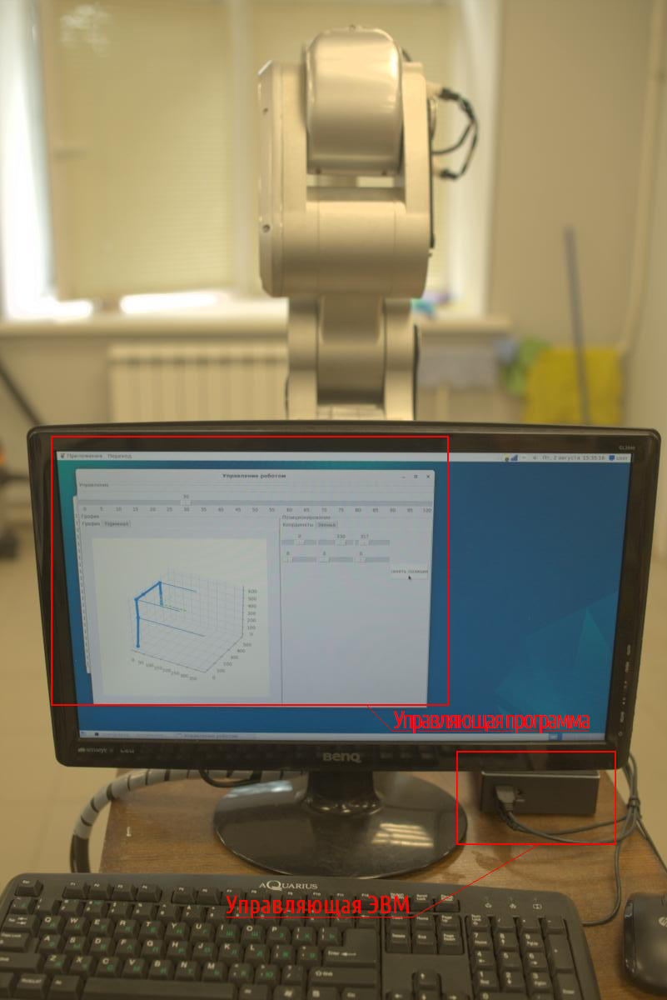

Рис. 1 - Общий вид платформы, управляющая программа и ЭВМ

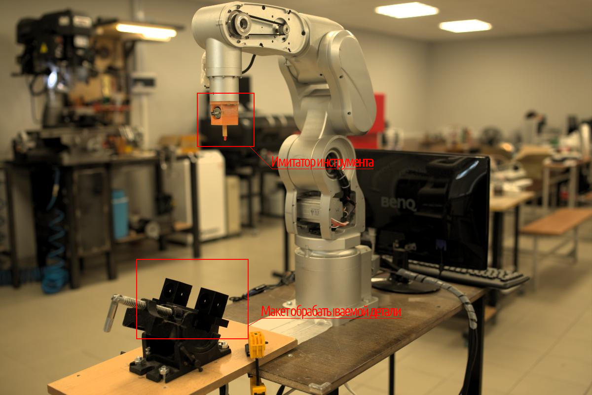

Рис. 2 - Общий вид платформы, имитатор инструмента и макет обрабатываемой детали

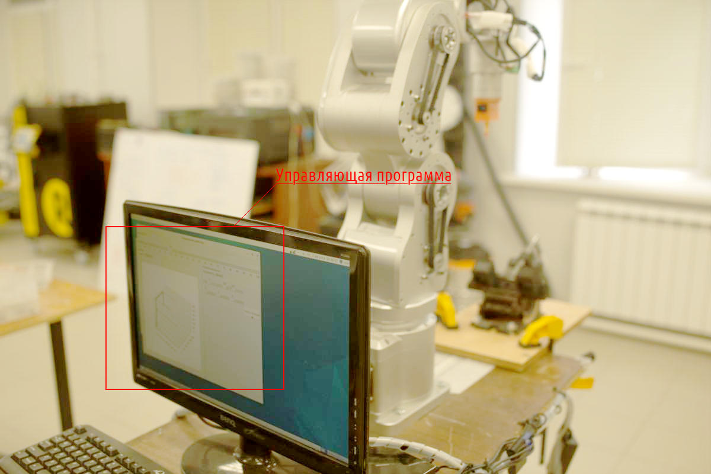

Рис. 3 - Общий вид платформы, управляющая программа и ЭВМ

### 1.2 Оснастка для робота-манипулятора

В рамках разработки системы для определения координат и ориентации фланца были
созданы имитаторы оснастки. Имитаторы представляют собой функциональные
прототипы оснастки, предназначенные для тестирования и отладки режимов работы
робота.

Имитаторы оснастки были изготовлены с использованием технологии 3D-печати. В
частности, были созданы следующие типы имитаторов:

1. Держатель светодиода, предназначенный для определения координат фланца
методом 3Д-фотометрии.

2. Держатель пары светодиодов, предназначенный для определения координат и
ориентации фланца методом стереофотометрии.

3. Держатель пары камер, предназначенный для создания стереосистемы и
определения координат и ориентации фланца методом стереофотометрии.

Каждый из имитаторов оснастки позволяет провести тестирование и отладку
соответствующих режимов работы системы, обеспечивая тем самым повышение её
эффективности и точности определения координат и ориентации фланцев.

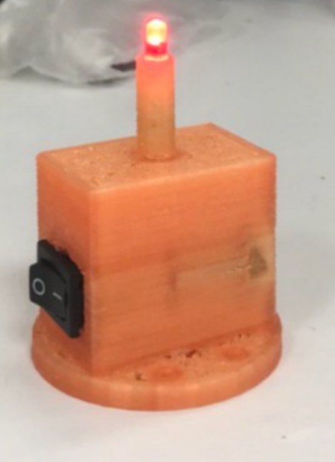

Рис. 4 - Держатель светодиода, 3Д-печать

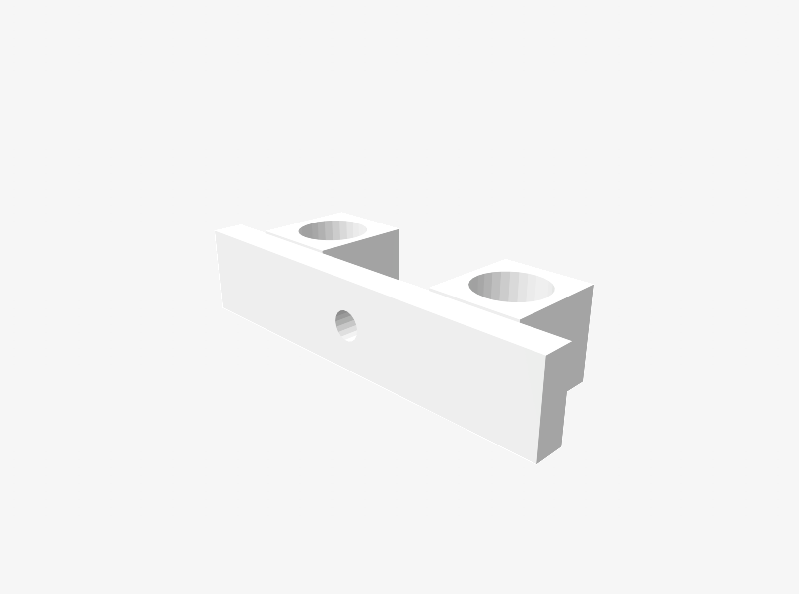

Рис. 5 - Держатель пары камер, stl-файл

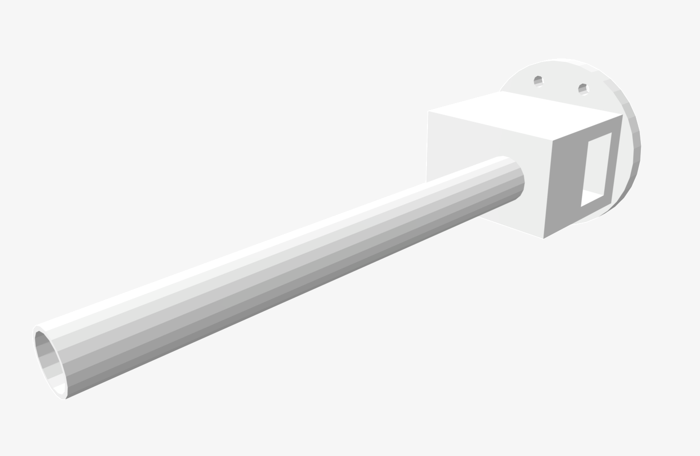

Рис. 6 - Держатель пары светодиодов, stl-файл

## 2. Реализация протокола управления манипулятором

Управление роботом осуществляется через последовательный порт.

Используемые библиотеки:

- from serial import Serial — библиотека для работы с последовательными портами.
- from serial.serialutil import SerialException — класс исключений, связанных с работой с последовательными портами.

Программа обеспечивает взаимодействие с роботом посредством последовательного
порта, позволяя отправлять ему команды и получать от него данные.
Инициализация программы включает создание объекта класса Serial для установки
соединения с последовательным портом и проверку наличия и доступности порта.
Для отправки команд роботу используется функция send(), которая может
принимать команды в виде строк или байтов.

Функция read() применяется для получения данных от робота, которые также могут
быть представлены в виде строк или байтов. В случае возникновения ошибок
программа выводит соответствующее сообщение.

Реализация протокола управления манипулятором включает в себя следующие
классы:

- State — базовый класс для всех возможных состояний программы. В рамках
  данного класса определены подклассы Ok и Error.
- Ok — класс, который представляет успешное выполнение команды.
- Error — класс, который представляет ошибку или исключение при выполнении
  команды.
- Port — класс, который представляет порт для подключения к роботу. Данный
  класс содержит методы для открытия и закрытия порта, а также для отправки и
  получения данных.


В методе init класса Port программа создаёт объект класса State, который,
представляет текущее состояние робота. Также программа пытается открыть
последовательный порт с указанным именем и скоростью передачи данных. Если
порт не указан, программа использует значение по умолчанию.

Если открытие порта не удалось, программа создаёт объект класса Error, который
содержит информацию об ошибке. Программа выводит эту информацию в stderr или
в очередь (в зависимости от значения переменной oufile). Затем программа
вызывает исключение SerialException, которое было сгенерировано при открытии
порта.

Робот выполняет команды G00 J1=j1 J2=j2 J3=j3 J4=j4 J5=j5 J6=j6 и G07 VP=vp
для управления его движением и регулировки скорости.

Команда G00 используется для перемещения робота в указанные координаты. В этой
команде параметры J1, J2, J3, J4, J5 и J6 определяют соответствующие оси
(X, Y, Z, A, B и C), по которым будет происходить перемещение. Значения этих
параметров указывают на необходимые координаты для перемещения робота.

Команда G07 предназначена для установки скорости робота. Параметр VP в этой
команде определяет значение скорости, с которой робот будет выполнять
последующие команды перемещения.

Для реализации команд G00 и G07 имеются методы G00() set_speed(). Метод G00
выполняет команды с несколькими параметрами (J1, J2, J3, J4, J5 и J6)
выполняет несколько основных шагов:

1) Определение параметров J1, J2, J3, J4, J5 и J6. Если параметры не указаны,
то используются значения по умолчанию (j1=0, j2=0, j3=0, j4=0, j5=0, j6=0).

2) На основе указанных параметров формируется команда G00. Команда включает в
себя параметры J1, J2, J3, J4, J5 и J6, разделённые пробелами. В конце
команды добавляется символ новой строки (\r\n) для корректного понимания 
команды роботом.

3) Команда записывается в файл журнала (oufile) и в очередь (queue). Если
робот работает с портом (work_w_port), то команда записывается в порт с
помощью метода write.

4) Состояние программы изменяется в зависимости от результата выполнения
команды. Если команда выполнена успешно, то состояние устанавливается в Ok.
Если возникает исключение (Exception), то состояние устанавливается в Error.

Таким образом, метод G00() позволяет выполнять команды с параметрами J1, J2,
J3, J4, J5 и J6, представляющими собой углы поворота звеньев робота,
записывать их в файл журнала или очередь для общения с интерфейсом, а также
обрабатывать результаты выполнения команд. Реализацию метода см. на лист. 1.

Листинг 1 - Реализация метода G00()

```python
def G00(self, j1=0, j2=0, j3=0, j4=0, j5=0, j6=0):
    try:
        cmd = f'G00 J1={j1} J2={j2} J3={j3} J4={j4} J5={j5} J6={j6}\r\n'
        self.__log(f'>> {cmd.strip()}', file=self.__oufile, queue=self.__queue)
        if self.__work_w_port: self.write(bytes(cmd,'ascii'))
        self.state = Ok(cmd)
    except Exception as e:
        self.state = Error(cmd, e)
```

Метод set_speed() предназначен для установки скорости движения робота. Метод
принимает параметр vp, который определяет желаемую скорость движения робота
(в процентах от максимальной).

В методе set_speed сначала формируется команда для установки скорости в виде
строки cmd. В команде используется параметр vp для указания желаемой
скорости. Затем команда cmd записывается в лог-файл и в порт робота. Если
порт открыт, то команда записывается в виде байтов с помощью метода write.

После записи команды состояние робота проверяется с помощью метода is_ready
для подтверждения успешной установки скорости. Если установка скорости прошла
успешно, то состояние робота устанавливается в Ok (всё в порядке). В
противном случае, если возникает исключение e, то состояние робота
устанавливается в Error с указанием команды и исключения. Реализацию метода
см. на лист. 2.

Листинг 2 - Реализация метода set_speed()

```python
def set_speed(self, vp=50):
    try:
        cmd = f'G07 VP={vp}\r\n'
        self.__log(f'>> {cmd.strip()}', file=self.__oufile, queue=self.__queue)
        if self.__work_w_port: self.write(bytes(cmd,'ascii'))
        self.state = Ok(cmd)
        assert self.is_ready()
    except Exception as e:
        self.state = Error(cmd, e)
```

Реализация протокола управления манипулятором имеет метод is_ready, который
проверяет, готов ли робот к выполнению следующих команд. Метод имеет
задаваемый таймаут (timeout=10000), равный 10 сек по умолчанию. Реализацию
метода см. на лист. 3.

Листинг 3 - Реализация метода is_ready()

```python
def is_ready(self, timeout=10000):
    if self.__work_w_port: 
        try:
            n = 0
            while 1:
                n += 1
                assert n < timeout, f'The timeout of {timeout / 1000} seconds was exceeded when performing operation {self.state.operation}'
                x = self.read_all().decode('ascii').strip()
                if x: self.__log(f'<< {x}', file=self.__oufile, queue=self.__queue)
                if '%' in x:
                    break
                sleep(0.001)
        except Exception as e:
            self.state = Error(self.state.operation, e)
            raise self.state
    else:
        self.__log('<< emulated!', file=self.__oufile, queue=self.__queue)
```

Таким образом, реализация протокола управления манипулятором позволяет
управлять роботом через последовательный порт, отправлять ему команды и
получать данные от него. Программная реализация протокола имеет методы для
перемещения робота в указанные координаты, установки скорости движения и
проверки готовности робота к выполнению следующих команд.

Таблица 2 - Классы и методы реализации протокола управления манипулятором

| Класс | Описание | Методы |
| --- | ------ | --- |
| State | Базовый класс, хранящий состояние робота | - |
| Ok | Класс, хранящий состояние робота в норме | - |
| Error | Класс, хранящий состояние робота в состоянии ошибки | - |
| Port | Программная реализация протокола управления манипулятором | init - подготовка к работе <br>log - журналирование <br>G00 - перемещение в координаты по углам звеньев <br>set_speed - установка скорости <br>is_ready - готовность к следующей команде |


## 3. Создание/настройка 6-координатной системы

Робот представляет собой установку, состоящую из шести звеньев. Каждое звено
имеет свой диапазон вращения, который представлен в таблице 3:

Таблица 3 - Минимальное и максимальное значение, град. 

| Номер звена | Минимальное значение, град. | Максимальное значение, град. |
| --- | --- | --- | 
| 1 | 90 | 90 |
| 2 | 50 | 50 |
| 3 | 50 | 50 |
| 4 | 90 | 90 |
| 5 | 90 | 90 |
| 6 | -180 | 180 |

Все звенья робота представлены на рисунке 7.


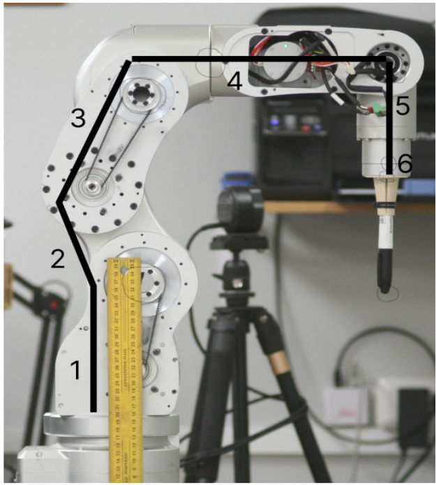

Рис. 7 - Звенья робота, схема

В реализации используются библиотеки matplotlib.pyplot и ikpy для работы с
установкой. Также используются классы Chain и OriginLink.

В рамках разработки модели манипулятора был создан объект класса `Chain` с
именем «manipulator», основанный на библиотеке ikpy который состоит из семи
звеньев. Активными являются следующие звенья: нулевое (основание робота),
первое, второе, третье, четвёртое, пятое и шестое (инструмент — фломастер).

Нулевое звено представляет собой `OriginLink` и характеризуется отсутствием
вращения и ориентации.

Первое, второе, третье, четвёртое и пятое звенья представлены объектами класса
`URDFLink` и имеют следующие характеристики:
- первое звено: `origin_translation` [0, 35, 370], `origin_orientation` [0, 0,
  0], `rotation` [1, 0, 0];
- второе звено: `origin_translation` [0, 0, 242], `origin_orientation` [0, 0,
  0], `rotation` [1, 0, 0];
- третье звено: `origin_translation` [0, 120-35, 0], `origin_orientation`
  [0, 0, 0], `rotation` [0, 1, 0];
- четвёртое звено: `origin_translation` [0, 210, 0], `origin_orientation`
  [0, 0, 0], `rotation` [1, 0, 0];
- пятое звено: `origin_translation` [0, 0, -145], `origin_orientation` [0, 0,
  0], `rotation` [0, 0, 1].

Шестое звено представляет собой описание инструмента `URDFLink` и имеет
следующие характеристики: `name` «pen», `origin_translation` [0, 0, -150],
`origin_orientation` [0, 0, 0], `rotation` [0, 0, 1]. См. табл. 4.

Таблица 4 - Характеристики звеньев робота

| Номер звена / инструмента | Координаты  |
| --- | --- |
| 0 | 0, 0, 0 |
| 1 | 0, 35, 370 |
| 2 | 0, 0, 242 |
| 3 | 0, 85, 0 |
| 4 | 0, 210, 0 |
| 5 | 0, 0, -145 |
| Инструмент | 0, 0, -150 |

## 4. Решение/настройка решения обратной и прямой задач кинематики

Решение задач обратной и прямой кинематики выполнено с использованием
библиотеки обратной кинематики ikpy, которая ориентирована на высокую
производительность и модульность.

IKPy — это библиотека на языке Python, предназначенная для решения задач
обратной кинематики (ИК) в робототехнике. Она позволяет вычислять обратную
кинематику для различных роботов и определять кинематические цепи с
использованием различных представлений, таких как DH и URDF. Библиотека также
позволяет автоматически импортировать кинематические цепи из файлов URDF.

С помощью IKPy можно:

- вычислять обратную кинематику для любого существующего робота;
- вычислять обратную кинематику в положении, ориентации или одновременно в
  обоих;
- определять кинематическую цепь с использованием произвольных представлений
  (DH, URDF и других);
- автоматически импортировать кинематическую цепь из файла URDF;
- использовать предварительно настроенные роботы, такие как Baxter или
  Poppy-torso;
- определять собственные методы обратной кинематики;
- анализировать файлы URDF;
- строить кинематическую цепь без необходимости использования реального робота
  или симулятора.

IKPy является точной (с точностью до 7 знаков после запятой) и быстрой
библиотекой (от 7 до 50 миллисекунд в зависимости от точности). Начиная с
версии 3.1, IKPy поддерживает только Python 3. Для более ранних версий
библиотеки возможна работа с Python 2.7 и 3.x. Рекомендуется использовать
sympy для быстрых гибридных вычислений, поэтому он устанавливается по
умолчанию. Для работы IKPy требуются библиотеки numpy и scipy.

Опционально может быть установлен matplotlib для построения графиков моделей в
3D (cм. рис. 8).


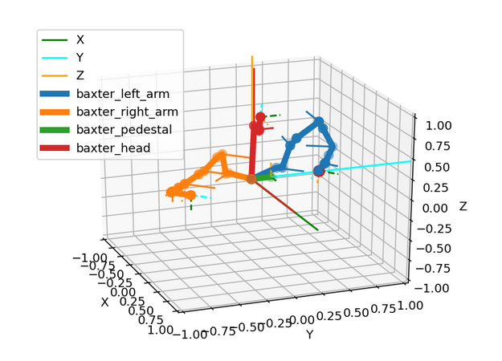

Рис. 8 - Пример работы ikpy

Для тестирования реализации обратной и прямой кинематики была создана
программа, которая решает задачу обратной и прямой кинематики для
манипулятора с использованием библиотеки ikpy.

Программа начинается с импорта необходимых библиотек: numpy для работы с
массивами, matplotlib.pyplot для создания графиков и mpl_toolkits.mplot3d для
создания трёхмерных графиков, а также ikpy для работы с кинематикой
манипулятора. Затем создаётся объект my_chain класса Chain, который
представляет манипулятор. Далее создаётся трёхмерный график ax, на который
будут выводиться результаты работы программы.

Затем задаются три массива: z, x и y, которые представляют координаты точек в
пространстве. Также задаются массивы rx, ry и rz, которые представляют углы
вращения звеньев манипулятора.

Далее начинается цикл, который перебирает все возможные комбинации координат и
углов. Для каждой комбинации программа решает обратную кинематическую задачу,
то есть находит такие положения звеньев манипулятора, чтобы его конец
оказался в заданной точке пространства. Результаты решения обратной
кинематической задачи сохраняются в массиве ik.

Затем программа строит график, на котором отображаются найденные положения
звеньев манипулятора.

После этого решается прямая кинематическая задача, то есть находятся
координаты конца манипулятора для найденных положений звеньев. Результаты
сохраняются в массиве pk. Наконец, программа выводит на экран координаты
точек, углы и координаты конца манипулятора для каждой комбинации. 

Таким образом, программа позволяет исследовать обратную и прямую кинематику
манипулятора для различных комбинаций координат и углов. Это может быть
полезно для разработки алгоритмов управления манипулятором или для анализа
его возможностей. Результат работы программы показан на рис. 9.

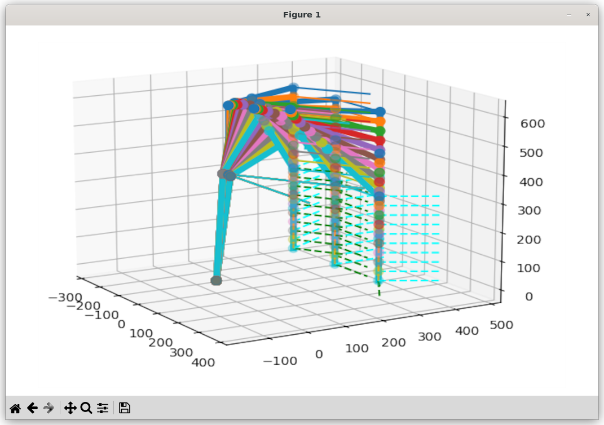

Рис. 9 - Результат тестирования кинематики

## 5. Описание произвольного (тестового) инструмента

В рамках исследования рассматривается произвольный (тестовый) инструмент, для
работы с которым используется инструмент Chain из библиотеки ikpy. Данная
библиотека предоставляет функционал для работы с кинематическими цепями и
позволяет моделировать движения различных механизмов.

В рамках исследования используется инструмент Chain, который состоит из
следующих элементов:

- URDFLink — элемент, который представляет собой звено кинематической цепи. В
  рамках исследования используется два типа URDFLink:
    - OriginLink — элемент, который определяет начальное положение звена в
      пространстве. В рамках исследования используется для определения
      начального положения звена «pen»;
    - name — имя звена, которое используется для идентификации звена в рамках
      исследования;
    - origin_translation — вектор, который определяет начальное положение
      звена в пространстве. В рамках исследования используется для
      звена «pen» и имеет координаты [0, 0, -150];
    - origin_orientation — вектор, который определяет ориентацию звена в
      пространстве. В рамках исследования используется для звена «pen» и
      имеет координаты [0, 0, 0];
    - rotation — вектор, который определяет вращение звена вокруг своей оси. В
      рамках исследования используется для звена «pen» и имеет координаты
      [0, 0, 1].

Листинг 4 - Реализация тестового инструмента

```python
URDFLink(
    name="pen",
    origin_translation=[0, 0, -150],
    origin_orientation=[0, 0, 0],
    rotation=[0, 0, 1],
),
```

Робот со смонтированным тестовым инструментом показан на рис. 10.

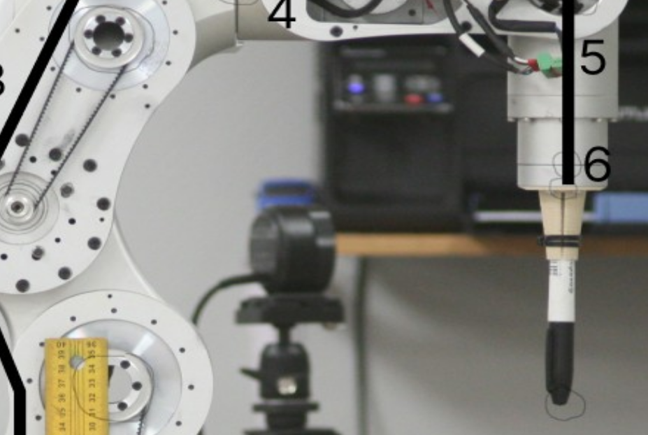

Рис. 10 - Тестовый инструмент на роботе

## 6. Разработка программы-имитатора электроэррозионной обработки


Программа-имитатор электроэрозионной обработки представляет собой комплексное
программное решение, предназначенное для моделирования процесса
электроэрозионной обработки материалов с использованием численных методов и
алгоритмов. Программа позволяет имитировать основные этапы и параметры
процесса, обеспечивая возможность исследования и оптимизации технологических
режимов.

Программа основана на использовании модулей и библиотек, таких как matplotlib,
numpy, tkinter и других, которые обеспечивают функциональность для
визуализации результатов, взаимодействия с пользователем и управления
процессом обработки.

Основные функции программы включают:

1) Имитация процесса электроэрозионной обработки. Программа позволяет
моделировать процесс удаления материала с использованием электрических
разрядов между электродом и обрабатываемой поверхностью.

2) Управление параметрами обработки. Пользователь может настраивать параметры
процесса, такие как ток, напряжение, частота импульсов и другие, для
исследования их влияния на качество и эффективность обработки.

3) Визуализация результатов. Программа предоставляет возможность визуализации
процесса обработки, что позволяет анализировать результаты обработки.

4) Пользователь может управлять процессом обработки с помощью интерфейса
программы, включая запуск, остановку и изменение параметров обработки.

Основным компонентом программы-имитатора является визуальный интерфейс
оператора (см. рис. 11). Интерфейс программы управления роботом представляет
собой интуитивно понятное и функциональное окружение, предназначенное для
взаимодействия пользователя с программой и роботом.

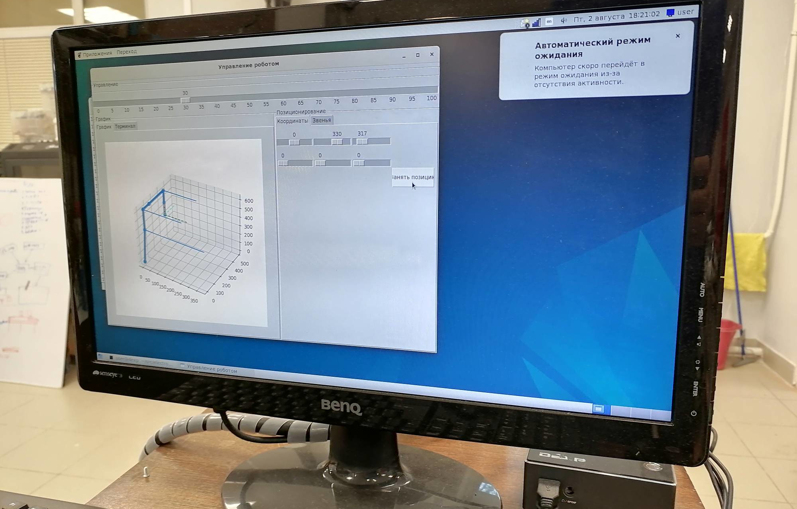

Рис. 11 - Визуальный интерфейс оператора

Элементы интерфейса выполнены в стиле, обеспечивающем удобство использования и
понятность для пользователя. Взаимодействие с программой осуществляется через
кнопки на панели инструментов и меню. Пользователь может выбрать функцию из
меню, ввести параметры в полях ввода или использовать кнопки для
непосредственного управления роботом.

Функция configure, которая используется для настройки параметров робота.
Функция принимает два аргумента: values и joints. Аргумент values содержит
начальные значения для координат робота в трёхмерном пространстве. Эти
значения сохраняются в переменных position. Аргумент joints содержит
начальные значения для звеньев робота. Эти значения сохраняются в переменных
joints.

После настройки параметров робота, функция создаёт три группы переменных:
position, rotation и joints. Каждая группа содержит по три переменные,
соответствующие трём осям координат.


При запуске программы создаётся главное окно приложения с помощью объекта
класса `Tkinter.Tk()`. Заголовок окна устанавливается с помощью `self.title`.
Для управления роботом создаётся фрейм с элементами управления — объект
класса `LabelFrame`. Ширина и высота фрейма задаются параметрами `width` и
`height`, а текст фрейма — параметром `text`.

Также создаётся фрейм, который будет содержать элементы управления графиком и
позиционированием — объект класса `Frame`. Для отображения графика создаётся
фрейм с объектом класса `LabelFrame`. Ширина фрейма задаётся параметром
`width`, а текст — параметром `text`. Затем создаётся объект класса
`Notebook` для создания вкладки с графиком, и добавляются две вкладки.

Для управления позиционированием создаётся фрейм с объектом класса
`LabelFrame`. Высота фрейма задаётся параметром `height`, а текст —
параметром `text`. Затем создаётся объект класса `Notbook` для создания
вкладки с позиционированием, и добавляются две вкладки с помощью метода
`add`. Внутри `Notbook` создаются дополнительные фреймы.

Для управления положением робота создаются объекты класса `Scale` — ползунки.
Ориентация ползунка задаётся параметром `orient`, диапазон значений —
параметрами `from_` и `to`, значение ползунка — параметром `showvalue`, а
переменная, связанная с ползунком, — параметром `variable`.

Для управления скоростью робота создаётся ползунок с объектом класса `Scale`.
Длина ползунка задаётся параметром `length`, диапазон значений — параметрами
`from_` и `to`, интервал между делениями — параметром `tickinterval`, а
разрешение — параметром `resolution`.

Элементы управления отображаются на фреймах с помощью метода `grid`. При
нажатии на кнопку выхода программа обрабатывает событие с помощью метода
`command`.

  
Интерфейс взаимодействует с роботом через модуль `robot`. Он представляет
собой набор классов, которые позволяют осуществлять контроль над его
движением и состоянием.

Класс RobotCalibration содержит методы для преобразования единиц измерения
углов в градусы и наоборот. Это позволяет обеспечить совместимость различных
систем измерения углов, используемых в роботе.

Методы класса RobotCalibration:

- units_to_degrees — преобразует единицы измерения углов в градусы.
- degrees_to_units — преобразует градусы в единицы измерения углов.

Класс RobotState представляет состояние робота. Он содержит информацию о
текущем положении и скорости робота.

Класс Robot представляет сам робот. Он содержит методы для управления его
движением и получения информации о его состоянии и абстрагирует класс Port,
описанный выше.

- init — инициализирует объект класса Robot.
- set_speed — устанавливает скорость робота.
- get_speed — получает текущую скорость робота.
- set_joint_pos — устанавливает положение суставов робота.
- get_joint_pos — получает текущее положение суставов робота.
- is_ready — проверяет, готов ли робот к следующей команде.

При инициализации объекта класса Robot указывается порт, к которому подключён
робот, и время ожидания ответа от робота (timeout). Для управления движением
робота используются методы set_speed и set_joint_pos. Метод set_speed
устанавливает скорость робота, а метод set_joint_pos — положение суставов.

Для получения информации о состоянии робота используются методы get_speed,
get_joint_pos и is_ready. Метод get_speed возвращает текущую скорость робота,
метод get_joint_pos — текущее положение суставов, а метод is_ready —
готовность робота к работе.

В классе RobotWindow, производном от Tk, реализуется метод timer. В рамках
этого метода происходит управление роботом. Сначала определяется значение
параметра speed с помощью элемента управления speedControl.

Затем происходит попытка получить текущие значения углов в суставах робота с
помощью списка `joints`. Если полученные значения отличаются от ранее
сохранённых (`joints_values_old`), то выполняется обновление графика и отправка
новых значений в очередь.

Полученные из очереди результаты сохраняются в словаре `j_values`. Затем
происходит печать содержимого этого словаря и установка углов в суставах
робота на основе полученных значений. Если скорость движения робота
изменяется, то происходит печать нового значения скорости и установка новой
скорости с помощью метода `set_speed`. Ранее сохранённые значения углов
звеньев сохраняются в переменной `joints_values_old`. 

В классе `RobotWindow` для получения состояния робота используется метод `timer`.
Данный метод вызывается с интервалом в 100 миллисекунд и выполняет ряд
действий. Получение текущих значений позиций и поворотов звеньев робота с
помощью переменных `position` и `rotation`.

Затем выполняется сравнение текущих значений с предыдущими сохранёнными
значениями `position_old` и `rotation_old`. Если значения изменились,
установка флага `update_graph` в `True` и печать текущих и предыдущих
значений.

Вызов метода `set_joint_pos` робота с новыми значениями позиций и поворотов
звеньев. Текущие значения сохраняются в переменных `position_old` и
`rotation_old`. При установленном флаге `update_graph` вызов метода `plot`
для отображения графика с текущими и предыдущими значениями. Повторный вызов
метода происходит с интервалом в 100 миллисекунд для продолжения выполнения.
Этот метод позволяет получать актуальное состояние робота и отслеживать
изменения в его позициях и поворотах суставов.

Описать взаимодействие интерфейса с нижележащими классами можно на примере 
относительно простых методов `set_speed` и `get_speed`.

Листинг 5 - Реализация методов set_speed() и get_speed()

```python
    def set_speed(self, speed):
        self.robot.set_speed(speed)

    def get_speed(self):
        speed = self.robot.get_speed()
        self.speedControl.set(speed)
```

1) Функция `set_speed` вызывается с параметром `speed`.

2) Вызывается метод `set_speed` объекта robot с переданным параметром `speed`. Это
означает, что скорость робота устанавливается равной значению параметра
`speed`.

3) Функция `get_speed` возвращает значение скорости робота с помощью метода
`get_speed` объекта `robot`.

4) Значение скорости сохраняется в переменной `speed`.

5) Значение переменной `speed` передаётся в метод set объекта `speedControl`,
который управляет скоростью чего-либо.

Таким образом, код устанавливает скорость робота с помощью параметра `speed`,
переданного в функцию `set_speed`, и управляет скоростью с помощью объекта
`speedControl` на основе значения скорости, полученного из объекта `robot`.

Аналогично работают остальные методы взаимодействия с "железом" робота.

## Выбор режимов электроэррозионной обработки.

Установка параметров процесса электроэрозионной обработки включает определение
электрических параметров режима, механических и гидравлических параметров.
Основные электрические параметры режима: энергия импульса, длительность
импульса, частота следования импульсов и скважность. Механические и
гидравлические параметры могут включать напряжение холостого хода, рабочее
напряжение, ток короткого замыкания, рабочий ток, напряжение горения дуги и
другие.

Список параметров интерфейса управления может включать следующие элементы:

- напряжение холостого хода (Uхх),
- рабочее напряжение (Ir),
- ток короткого замыкания (Iкз),
- рабочий ток (Ir),
- энергия импульса (Wi),
- частота следования импульсов (f),
- длительность импульса (ti),
- скважность импульсов (nск),
- значение ёмкости (C, мкФ) и индуктивности (L, мкГ) для генераторов импульсов.

Рассмотрим подробнее процесс установки режима ЭЭО. Как написано в
статье "Анализ структурных изменений в поверхностном слое деталей после
электроэрозионной обработки" (Абляз Т. Р.), электроэрозионная обработка
проведена на проволочно-вырезном станке фирмы Electronica. 

В качестве рабочей жидкости использована дистиллированная вода. В качестве
электрода-инструмента использована проволока из латуни марки Л68. Обработку
проводили в соответствии с режимами, приведенными в табл. 5. 

Таблица 5 - Режимы обработки

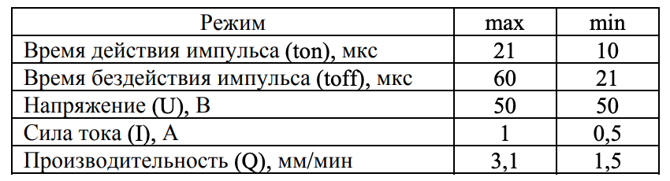


Для выявления влияния сформированного измененного слоя на эксплуатационные
свойства обработанной детали авторами статьи применен метод дюрометрического
анализа. Согласно результатам эксперимента, изменения микротвердости стальных
заготовок, обработанных методом проволочно-вырезной ЭЭО поверхностей образцов
не выявлено. 

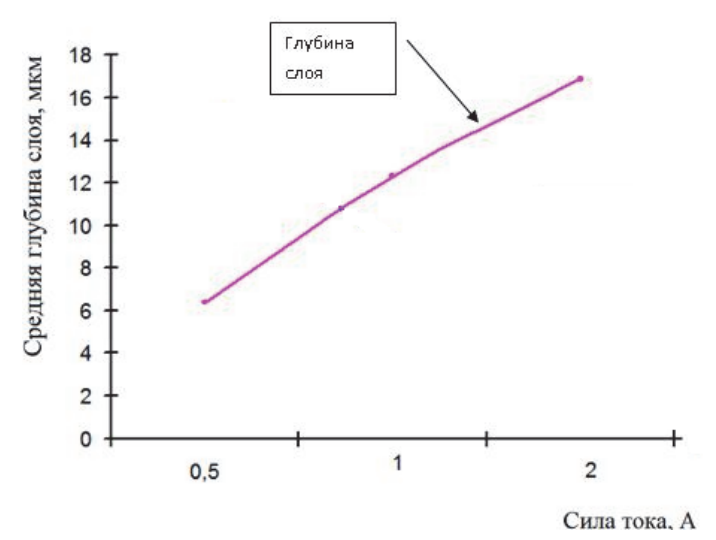

Рисунок 13 - Общий график зависимости глубины измененного слоя от силы тока

Также, в статье "Моделирование температурного воздействия единичного импульса
при электроэрозионной обработке (Т.Р. Абляз, К.Р. Муратов, Е.Е. Красновский,
Д.А. Борисов) было проведено моделирование взаимосвязи параметров. Как
указано в статье, по результатам моделирования построен график изменения
температуры на поверхности детали при ЭЭО (рис. 14).

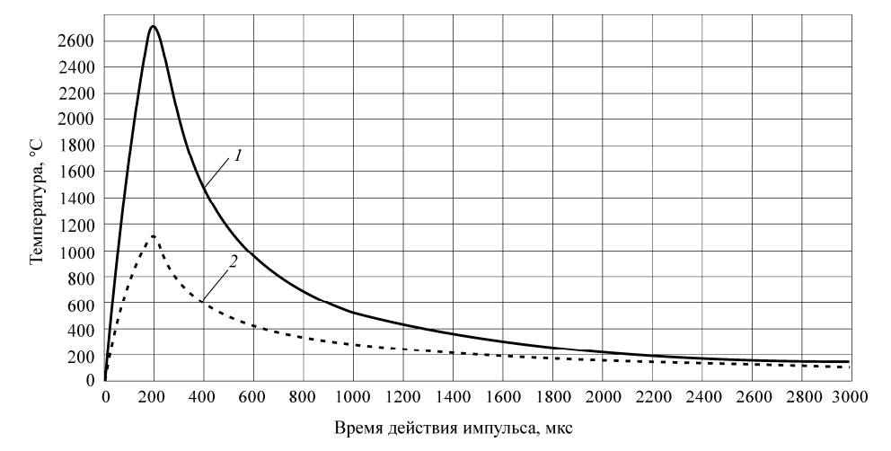

Рисунок 14 - График изменения температуры на поверхности детали в результате
воздействия импульса: 1 – температура на поверхности детали в центре разряда;
2 – температура на поверхности детали на границе радиуса действия плазмы

Исходя из этого, в интерфейсе управления были созданы соответствующие элементы
для указания параметров ЭЭ обработки, с учётом материала, направления и
глубины воздействия. Внешний вид интерфейса на рис. 15.

Рисунок 15 - Внешний вид интерфейса управления параметрами ЭЭО.

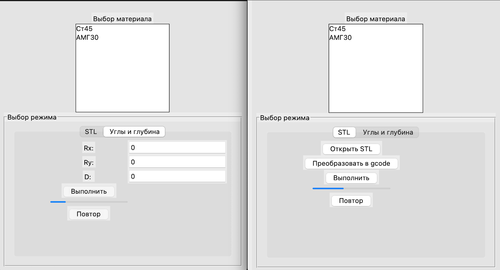

Исходя из полученных в публикациях данных, и используемого материала
(выбирается пользователем) были определены предустановленные значения в
интерфейсе управления роботом. 

Учитывая данные о минимальной и максимальной толщине слоя (из рис. 13) -
примем за эталон минимальное, среднее и максимальное значения (6, 11, 16
мкм). Соответственно, при передаче модели в слайсер (используется Ultimaker
Cura), также передаются параметры толщины слоя и скорости перемещения, они
учитывается при преобразовании в gcode. Для того, чтобы интерфейс не зависал
во время слайсинга, используется модуль subprocess, который запускает
отдельный процесс, и передаёт ему необходимые параметры.

Листинг 6 - Функция запуска слайсера Ultimaker Cura

```python
def start_cura(script='cura_run.sh', cura_dir=CURA_DIR_NAME, out_file='object.gcode'):
        status = 0
        res = {}
        cura_path = '/'.join(os.path.abspath(BASE_DIR).split('/')[:-1] + [cura_dir])
        try:
            subprocess.call(['bash', f'{cura_path}/{script}'])
            time.sleep(3)
            interface_gcode_path = f'static/3d_models/{out_file}'
            print(interface_gcode_path)
            shutil.move(f'{cura_path}/{out_file}', interface_gcode_path)
            res = {'gcode': f'/static/3d_models/{out_file}'} # no {app_cur_dir} because static url is the same in browser for dev and prod
        except FileNotFoundError as e:
            res['error'] = f'File not found error!: {e}'
        except OSError as e:
            res['error'] = f'Seems that destination is not writable!: {e}'
        except IOError as e:
            res['error'] = f'IO error!: {e}'
        except subprocess.CalledProcessError as e:
            res['error'] = f'CalledProcessError -> CuraEngine error: {e}'
        except subprocess.SubprocessError as e:
            res['error'] = f'SubprocessError: {e}'
        except subprocess.TimeoutExpired as e:
            res['error'] = f'TimeoutExpired: {e}'
        except Exception as e:
            res['error'] = f'Unknown error!: {e}'

        return res

```

Приведенный фрагмент кода отвечает за работу с внешним слайсером Ultimaker
Cura.

1) Вначале задается путь к исполняемому файлу слайсера;

2) Далее происходит запуск слайсера в дочернем процессе. Для этого можно
использовать команду запуска процесса в операционной системе или
специализированные инструменты для работы с процессами.

3) Определение пути к получаемому результату слайсинга. После запуска слайсера
результат окажется в файле object.gcode.

4) Обработка возможных ошибок:

- FileNotFoundError — ошибка, которая возникает, когда указанный файл не может
  быть найден.
- OSError — общее название для ошибок, связанных с операционной системой.
  Может возникать при различных проблемах с файловой системой, доступе к
  файлам и т. д.
- IOError — ошибка, связанная с вводом-выводом (input/output). Может возникать
  при проблемах с чтением или записью данных.
- CalledProcessError — возникает, когда подпроцесс завершается с ненулевым
  кодом возврата.
- SubprocessError — общее название для ошибок, связанных с подпроцессами.
  Может возникать при различных проблемах с выполнением команд в
  подпроцессе.
- TimeoutExpired — возникает, когда время выполнения команды в подпроцессе
  истекло.

Запуск процесса ЭЭО

Для запуска процесса электроэрозионной обработки (ЭЭО) пользователю необходимо
выполнить следующие действия.

1) Выбор материала обработки. Необходимо выбрать материал, который будет
подвергаться обработке.

2) Выбор варианта обработки. Необходимо выбрать один из двух вариантов
обработки: из STL-файла или по углам и глубине обработки.

3) Преобразование STL-файла в G-код (при необходимости). Если выбран вариант
обработки из STL-файла, необходимо нажать кнопку «Преобразовать в G-код».

4) Установка значений углов и глубины обработки. Если выбран вариант обработки
по углам и глубине, необходимо установить значения `Rx`, `Ry` и глубины обработки
`D`.

5) Нажатие кнопки «Выполнить». После выполнения всех предыдущих шагов
необходимо нажать кнопку «Выполнить», чтобы запустить процесс обработки.


Таким образом разработан процесс установки параметров электроэрозионной
обработки (ЭЭО), который включает определение электрических, механических и
гидравлических параметров. На основе полученных данных был создан интерфейс
управления параметрами ЭЭО, который учитывает материал, направление и глубину
воздействия. Предустановленные значения в интерфейсе управления роботом
определяются пользователем в зависимости от выбранного материала и требуемых
параметров обработки.

Для преобразования модели в G-код используется слайсер Ultimaker Cura. При
этом учитываются параметры толщины слоя и скорости перемещения, которые
передаются в интерфейс управления роботом. Для предотвращения зависания
интерфейса во время слайсинга используется модуль subprocess, который
запускает отдельный процесс и передаёт ему необходимые параметры.

Запуск процесса ЭЭО включает выбор материала обработки, выбор варианта
обработки (из STL-файла или по углам и глубине), преобразование STL-файла в
G-код (при необходимости), установку значений углов и глубины обработки и
нажатие кнопки «Выполнить».


## Заключение

В данном тексте были рассмотрены основные этапы разработки и настройки
платформы и программного обеспечения для робота-манипулятора. Были описаны
создание платформы, оснастки, реализация протокола управления манипулятором,
создание 6-координатной системы, решение задач обратной и прямой кинематики,
разработка программы-имитатора электроэрозионной обработки и взаимодействие
интерфейса с нижележащими классами.